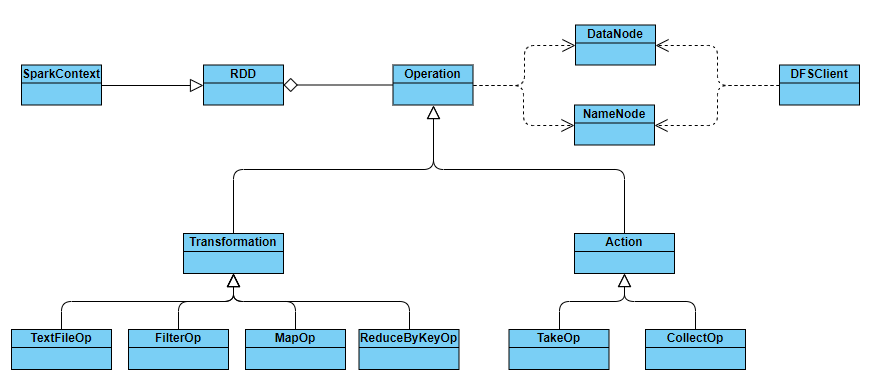

# simple-spark

## 一、System architecture

This project implements a mini-version of Spark. The overall class diagram is



- **DFSClient**：The client of our Distributed File System (DFS), only for reading and writing operations.
- **NameNode**：Coordinate data reading and writing.
- **DataNode**：Perform actual data reading, writing and computing.
- **RDD**：Record the relevant information of Resilient Distributed DataSets (RDD), such as operations, child nodes, id, etc. It also defines operations such as `textFile`, `map`, `take`, etc., as interfaces provided to users.
- **Operation**：As an Abstract class, its subclasses include `Transformation` and `Action` classes. They have actual operation subclasses such as `TextFileOp`, `MapOp`, `TakeOp`, etc., which define a unified interface (such as `__call__`) for RDD to invoke and perform actual computing.
- **SparkContext**：The context of our Spark. It is a special RDD as the root of the computing graph.

## 二、Installation and use
```shell
# Download the repository to local
git clone https://github.com/controny/simple-spark
cd simple-spark
# Install the required python packages
python3 scripts/install_all.py
# Set up the configuration
cp common_template.py common.py
vim common.py
# One-click deployment of all nodes
python3 scripts/start_all.py
# One-click termination of all nodes
python3 scripts/stop_all.py
```
